# Dubai-XT-Clone — IBM PC/XT Compatible Turbo Motherboard

> **🤖 This board talks to LLMs!** Meet **[LMChat](https://github.com/spencer-uk/LMChat)** — the world's first [LM Studio](https://lmstudio.ai) AI client for V20/8088 IBM PC XT computers. Two chat clients (MS-DOS and ELKS) that let the DubaiXTClone hold a real conversation with a modern Large Language Model — no cloud, no API key, no subscription.

---

<h3 align="center">DubaiXTClone and IBM5160</h3>

  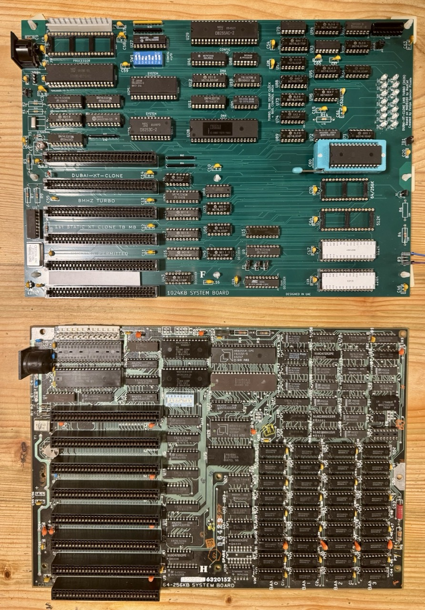

Top ->Dubai-XT-Clone (New Design)

Bottom ->IBM5160 (IBM PC XT Design)

<h3 align="center">Top view</h3>

  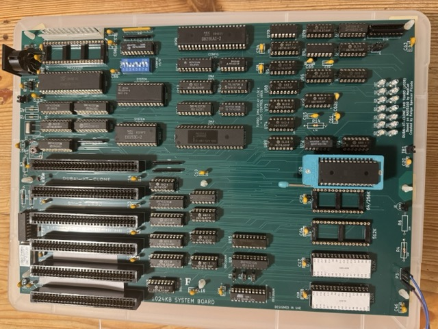

---

## The Story Behind This Board

This board was born in Dubai in 2026, making it almost certainly **the first Turbo PC/XT Clone Motherboard ever designed in the UAE**. It was not built to tick a box or replicate something that already existed. It was built because the board that Felipe Spencer Picada wanted — minimal, clean, modern, with everything a serious PC/XT enthusiast actually needs — simply did not exist yet.

Felipe has been practicing electronics since the age of eight. This is a project built on decades of hands-on experience, genuine curiosity, and the kind of stubbornness that keeps a person solving until it works. The DubaiXTClone is not a kit pre-assembled. It is an original design, created from a deep understanding of IBM 5160/5150 circuit — and a clear vision of how it could be improved.

The result is an **8088 Turbo 8MHz PC/XT compatible motherboard** with static RAM, real-time bus indicators, and the soul of those legendary Taiwanese turbo clones, now redesigned in UAE.

> *"I had great pleasure studying existing clones and creating the board I always wanted to have."*
> — Felipe Spencer Picada

---
## Overview

**TLDR:** 8088 Turbo 8MHz motherboard, IBM 5160/5150/PC-XT compatible, with static RAM and zero DMA drama.

This board cannot really be called a clone — it is a fundamentally different design from the original IBM 5160. Virtually every subsystem has been revisited: the timer clock, speaker circuitry, bus arbitration, DMA clock, keyboard clock, reset circuit, and memory architecture have all been rethought. What remains is full PC/XT compatibility and the spirit of the era.

The goal was simple: reduce the IC count as far as possible without sacrificing the feel of the platform. The result is a clean, buildable board that anyone with an AliExpress or eBay account (not affiliated to neither) can source and assemble. No exotic or impossible-to-find parts. No excuses not to build one.

Inspiration came from the famous Taiwanese turbo clones. Those boards were a revelation — faster, leaner, and more practical than the IBM original. This board carries that tradition forward.

One more thing: this board was designed to serve as a **personal test bench**. Original IBM 5160 boards and their clones are ageing, increasingly scarce, and growing more expensive every year. Having a fresh, fully documented board to experiment on means no original hardware ever needs to be put at risk.

---

## Key Differences from IBM 5160

- Clock for timer
- Speaker circuitry
- DRAM replaced by SRAM — no refresh circuit, no refresh drama
- Bus arbitration circuit
- DMA clock
- Keyboard clock
- Reset circuit
- J7 and J8 slots removed — 6 slots is the right number, rarely are more than 5 ever used
- Parity check removed from the circuit

Speed switching works just like every great turbo board: press **Ctrl+Alt++ / Ctrl+Alt+-** to toggle between 8MHz turbo and 4.77MHz normal mode at any time — no jumper required.

During the DRAM-to-SRAM conversion, several logic gates found themselves without a job. Rather than leave them idle, they were put to work driving onboard LEDs — giving the board a live window into everything the bus is doing in real time. They also look spectacular.

The ATF16V8 PLD source code is included — see `CODE.PLD`. A few additional equations could replace a 74LS138 and several other chips for ROM address decoding, leaving further room for simplification.

---

## Memory

The board is capable of addressing **1024KB** — technically more. However, using memory beyond 640KB under MS-DOS requires bank switching logic and additional chips to manage the EMS memory window and its segments expected by the EMS driver. That additional complexity was deliberately left out: the gain is modest and the cost in components and board space is not worth it for this design.

The board ships configured for **640KB**. For those who want to push further, a new PAL implementation with a few extra equations is all it takes for few dozen KB more. The circuit is ready — the challenge is open.

---

## Onboard LED Indicators

One of the most distinctive features of the DubaiXTClone is its real-time bus activity display. Several logic gates, freed up by the move from DRAM to SRAM, were repurposed as LED drivers rather than left unused. The result is a live, always-on view of exactly what the system is doing — invaluable for debugging, and genuinely satisfying to watch during normal operation.

| LED | Signal | Description |
|-----|--------|-------------|
| PWR | Power | Board is powered |
| IRQ1 | IRQ1 | Interrupt Request 1 active |
| DMA | DMA | DMA transfer in progress |
| IOR | IOR | I/O Read cycle |
| ROM | ROM | ROM being accessed |
| INTR | INTR | Interrupt signal active |
| MEMR | MEMR | Memory Read cycle |
| PPI | PPI | PPI activity |
| AEN | AEN | Address Enable — DMA has control of the bus |
| RAM | RAM | RAM being accessed |
| IOW | IOW | I/O Write cycle |
| TURBO | TURBO | Turbo mode active |
| T/C | T/C | Terminal Count |

**RN8** is a resistor network controlling indicator brightness. 510Ω resistors were selected based on the current ratings of the driver chips — bright enough to read clearly, safe enough to run indefinitely.

<h3 align="center">Onboard LED Indicators</h3>

  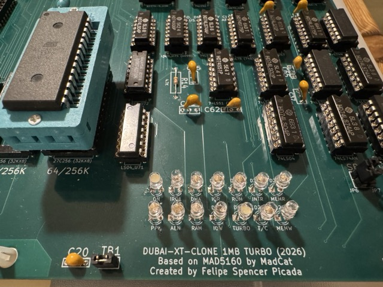

---

## Screenshots

<h3 align="center">LMChat — Talking to a Local LLM via LM Studio.ai</h3>

<h3 align="center">Running ELKS</h3>

  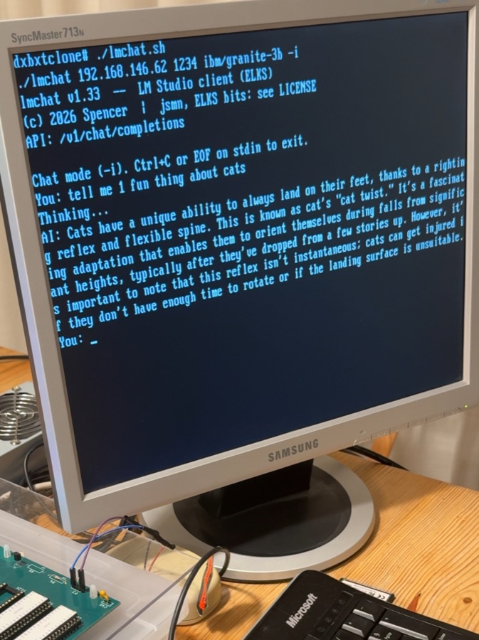

<h3 align="center">Running MS-DOS</h3>

  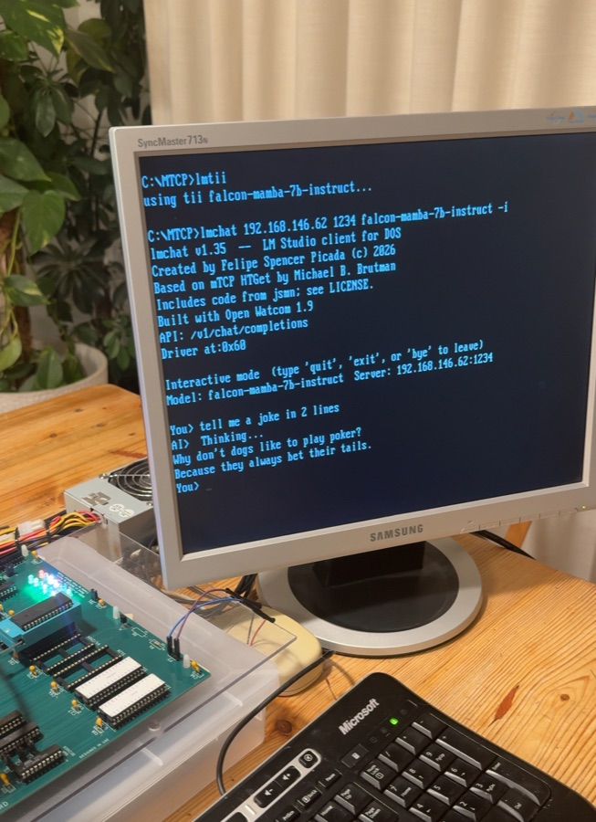

<h3 align="center">Running Windows 3.0</h3>

  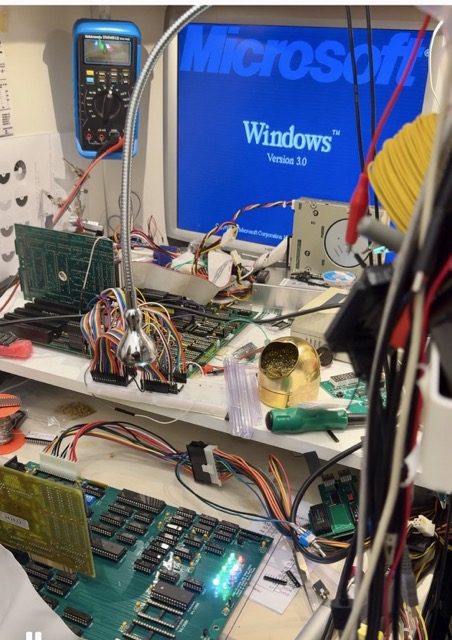

<h3 align="center">Running Diagnostics</h3>

  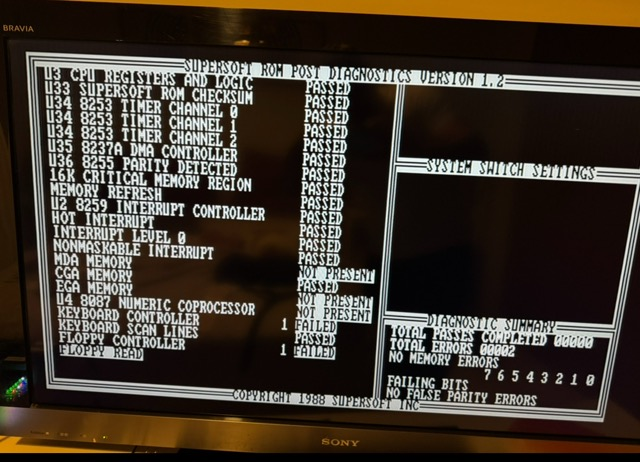

---

## Board Photos

<h3 align="center">Close Up</h3>

  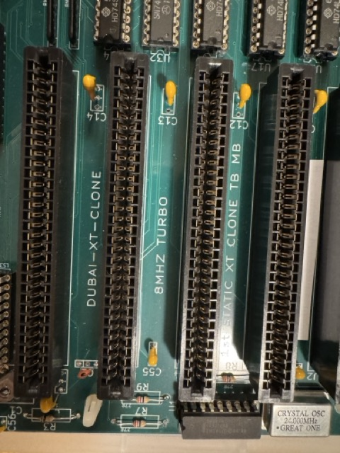

<h3 align="center">Processor and Latches</h3>

  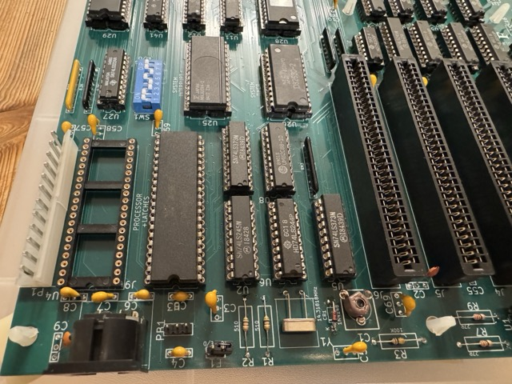

<h3 align="center">PCB Coming from Production</h3>

  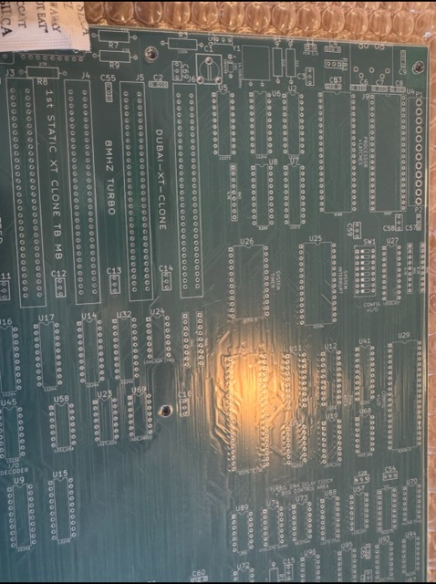

---

## DIP Switch Configuration

The board uses a DIP switch bank to configure key system parameters at boot time, following the classic PC/XT convention.

<h3 align="center">DIP Switch — Close Up</h3>

  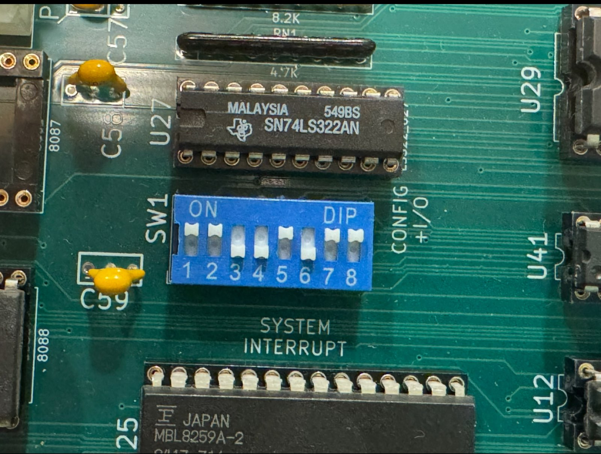

---

## Jumpers

**TB1 — Turbo Select**
Sets the default CPU clock speed at power-on. Turbo position selects 8MHz; normal position selects 4.77MHz for maximum compatibility. Speed can be toggled at any time via **Ctrl+Alt++ / Ctrl+Alt+-** without touching the jumper.

---

## BIOS

The board is compatible with any BIOS that does not strictly require parity check — parity has been removed from the circuit entirely.

Tested and confirmed working:
- **JUKO 2.3**
- **Turbo BIOS 3.1 (Anonymous)**
- **Award BIOS**

**Recommended:** Turbo BIOS ROM for the best balance of compatibility and performance.

---

## ROM BASIC

Tested with an original IBM ROM BASIC chip. BASIC loads and runs correctly.

---

## Compatibility

All of the following were tested and confirmed working in turbo mode at 8MHz:

- SVGA Trident cards
- 3COM network cards
- RTC cards
- Floppy controller
- XTIDE

---

## Design Files

The board was designed in **KiCad 9** as a **4-layer PCB**, with dedicated power and ground planes for clean power delivery and signal integrity.

- **Schematic PDF** — available in the `PDF/` folder
- **PAL Source Code** — see `CODE.PLD` for the ATF16V8 equations
- **BOM** — see `ibom.html` for bill of materials in interactive form
---

## V1 Fixes

The first version of the board had a few routing errors identified during bring-up. These were corrected with short wire bridges on the bottom copper layer — a completely normal part of first-article hardware development. The board was fully functional after the corrections were applied.

<h3 align="center">V1 Fix — Bottom Layer Wire Correction Picture #1</h3>

  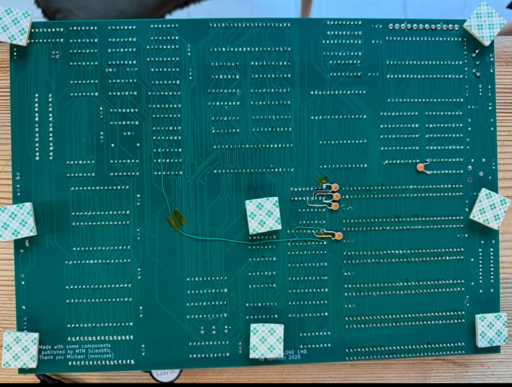

<h3 align="center">V1 Fix — Bottom Layer Wire Correction Picture #2</h3>

  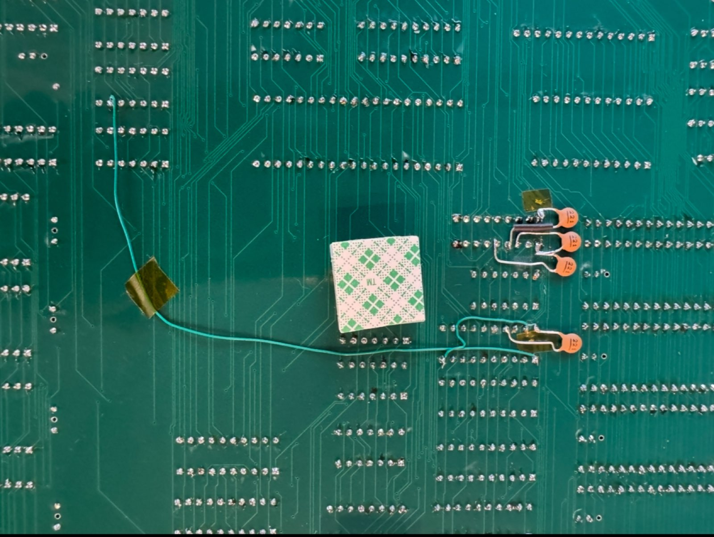

The schematic has been updated with those fixes and it has few notes on each change, it's just those capacitors and two wires replacing some wrong connection. Once a new board is released those changes wil be incorporated.

---

## Future Work

There are several natural next steps for this design — replacing the ROM decoder logic with a GAL/PAL (the circuit is already prepared for this), implementing EMS bank switching to unlock the full 1024KB address space, and further consolidating the remaining TTL logic. The board was designed with expansion in mind. Pull requests and new ideas are welcome.

---

## Other Pictures

<h3 align="center">Picture 1</h3>

  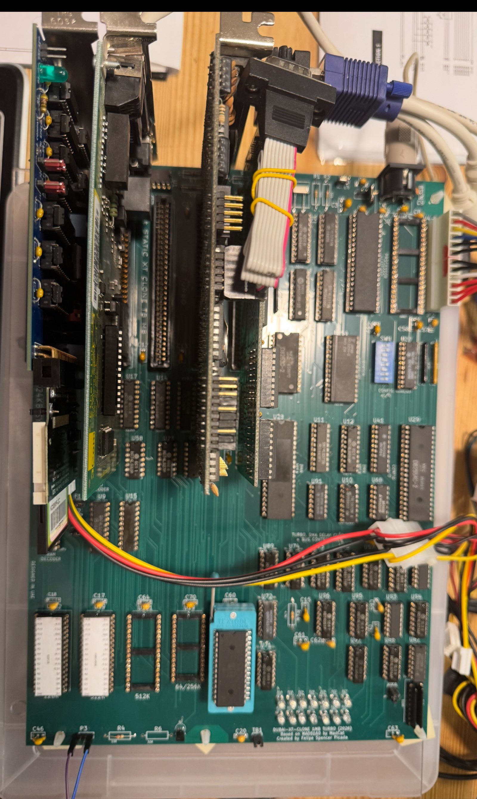

<h3 align="center">Picture 2</h3>

  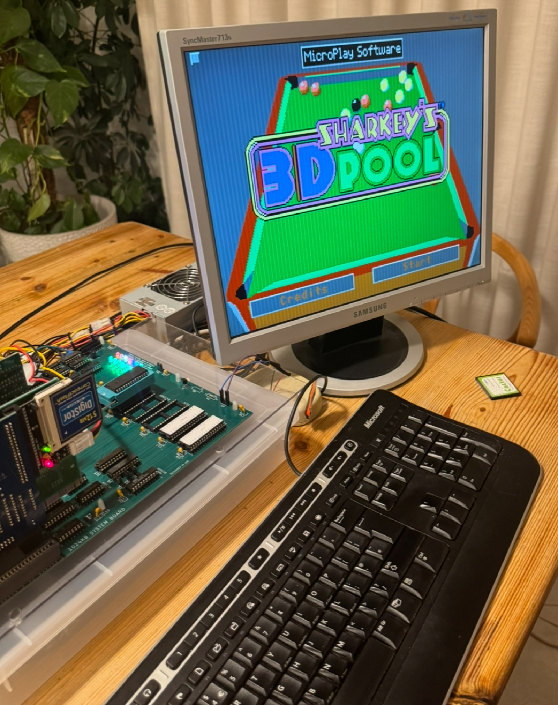

<h3 align="center">Picture 3</h3>

  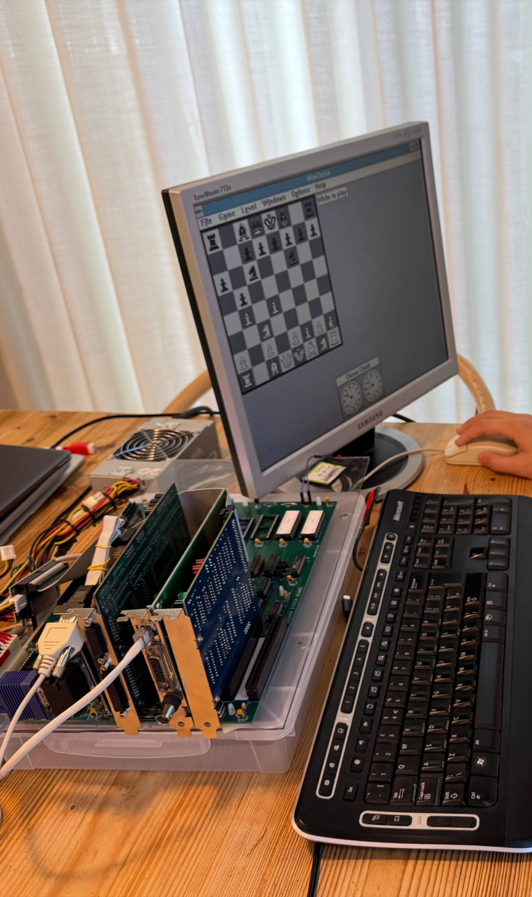

---

## Acknowledgements

A project like this does not happen in isolation. These people, companies, and communities made it better, directly or indirectly, and they deserve to be named.

- **IBM** — for a decision that shaped the entire personal computing industry. In an era defined by closed systems and proprietary everything, IBM published the full technical reference for the IBM 5150 and 5160, including schematics, BIOS source code, and hardware specifications. That act of openness — whether strategic or accidental — created an ecosystem that still lives today. This board would not exist without it.

- **The Taiwanese Clone Makers** — the dozens of manufacturers who, through the 1980s, took IBM's open architecture and ran with it. Faster, cheaper, more practical, and endlessly varied. Their turbo boards, their creative engineering, and their willingness to iterate rapidly on the platform are the direct inspiration for the DubaiXTClone. They proved that the design could be improved — and that anyone with enough skill and determination could do it.

- **JUKO Electronics** — makers of the JUKO PC/XT clone, which was Felipe Spencer Picada's very first personal computer. That machine is where it all started. It is fitting that JUKO BIOS 2.31 — and other versions — run perfectly on the DubaiXTClone today.

- **Prologica / CP-500** — Felipe wrote his first lines of code on a Prologica CP-500. Every project has an origin. That was it.

- **Madcat** — for his outstanding work on [mad5160](https://github.com/madcatse/mad5160). His research, documentation, and generosity in releasing everything to the public made this project significantly easier. His name is on the silkscreen of every DubaiXTClone board.

- **Minuszerodegrees** — for maintaining one of the most comprehensive archives of PC/XT technical information on the internet. An indispensable resource for anyone working in this space.

- **Sergey Kiselev (skiselev)** — a constant source of inspiration in the open hardware retro computing community. His work demonstrates what is possible when knowledge is shared freely.

- **MTM Scientific (Michał — mmruzek)** — for releasing his work on the IBM 5150. Several KiCad library components were used from his project, and his name is also printed on the silkscreen of this board.

---

## Disclaimer
The project is provided on a "as is" basis without any warranty. Enjoy at your own risk.

---
## License

Copying permitted — see [LICENSE](./LICENSE) for full details.

© 2026 Felipe Spencer Picada
Based on mad5160 by madcatse (MIT License)

